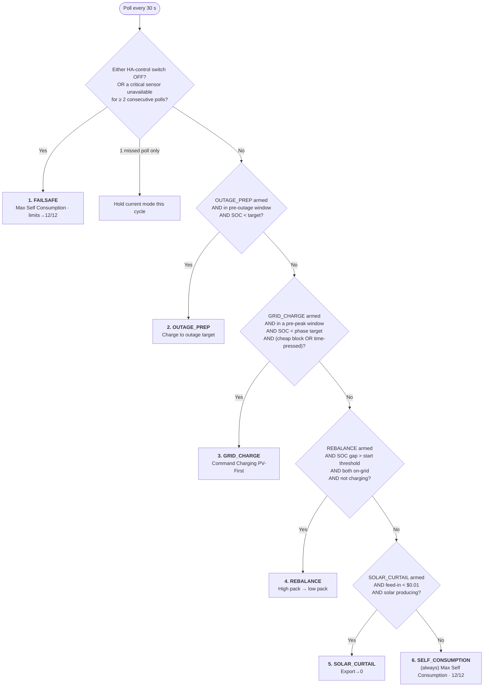

# Sentinel — Control Logic & Decision Tree

How Sentinel decides what to do every 30 s, and exactly which Sigen controls it
writes in each mode. Companion to `CLAUDE.md` (architecture), `OPTIMISATION_PLAN.md`
(the self-running design) and `ISSUES.md` (field faults). Source of truth:
`custom_components/sentinel/coordinator.py` + `learning.py` + `const.py`.

> **Redesigned July 2026** (branch `feature/self-running-optimisation`). The stack
> dropped from 8 modes to 6: **SPIKE_EXPORT** and **MORNING_FLOOR** were removed,
> and **GRID_CHARGE** became a single self-tuning two-peak charger whose targets
> are *learned* and whose deadline is the *detected* price-peak onset.

---

## 1. The controls Sentinel drives

The four Sigen actuators Sentinel writes to, per plant (S1 = Plant 1 `.82`,
S2 = Plant 2 `.79`). Sentinel never touches anything else, and **must never**
touch `switch.sigen_plant_*_plant_power`.

| Entity | What it does | Sentinel uses it to… |
|---|---|---|
| `select.…remote_ems_control_mode` | battery operating mode | switch between self-use, forced charge, forced discharge |
| `number.…grid_import_limitation` | max grid **import** power (0–12 kW) | set grid-charge rate; `0` = block import |
| `number.…grid_export_limitation` | max grid **export** power (0–12 kW) | set discharge/export rate; `0` = curtail solar |
| `number.…ess_backup_state_of_charge` | blackout reserve SOC | *(no longer written — MORNING_FLOOR removed)* |

Two **authority switches** sit upstream:
- `switch.sigen_plant_*_remote_ems_controlled_by_home_assistant` — the Sigen's own
  "let HA drive me" switch. **If either is off, Sentinel drops to FAILSAFE.**
- `switch.sentinel_*_enabled` — Sentinel's per-mode arming switches (Grid Charging,
  Rebalancing, Solar Curtail, Outage Prep). **All default OFF.**

### Write pacing — never flood a dongle

Every Modbus-backed write routes through `_paced_service_call`: consecutive
writes are **≥0.4 s apart** (`WRITE_MIN_GAP_SECONDS`) and each is **awaited to
completion** before the next, so a mode change touching several controls trickles
out one command at a time. Writes that are a no-op (already within
`WRITE_TOLERANCE` of the target) or aimed at an unreachable plant
(`_plant_is_reachable_for`, gated on the plant's SOC sensor) are skipped — so
steady state issues **zero** Modbus writes.

---

## 2. The decision tree

Every 30 s the coordinator evaluates a fixed **priority stack** — first mode whose
trigger is true wins, and only that mode writes controls this cycle.

---

## 3. What each mode writes to the controls

Blank = left untouched. "12/12" = import 12 kW + export 12 kW (full inverter).

| # | Mode | EMS mode | Import limit | Export limit |
|---|---|---|---|---|
| 1 | **FAILSAFE** | Max Self Consumption | 12 kW | 12 kW |
| 2 | **OUTAGE_PREP** | Command Charging (PV First) | charge-rate split¹ | 12 kW |
| 3 | **GRID_CHARGE** | Command Charging (PV First) | charge-rate split¹ | 12 kW |
| 4 | **REBALANCE** | high→Discharging PV-First, low→Charging PV-First | high `0` / low rate² | high rate / low `0`² |
| 5 | **SOLAR_CURTAIL** | Max Self Consumption | 12 kW | **0 kW** |
| 6 | **SELF_CONSUMPTION** | Max Self Consumption | 12 kW | 12 kW |

¹ **Charge-rate split** — total `grid_charge_rate_kw` split across the plants,
biased toward the lower-SOC pack (`share = 0.5 + gap/200`), so charging also
nudges the packs together and REBALANCE needn't fire.

² **Rebalance** — higher-SOC plant discharges (export = transfer rate, import 0);
lower-SOC plant charges (import = transfer rate, export 0). Nets to ≈0 at the
single meter, so only round-trip loss is paid.

**Restore-on-exit** (only on a clean mode *change*): leaving GRID_CHARGE /
OUTAGE_PREP restores all grid limits to 12/12.

---

## 4. GRID_CHARGE — the self-tuning two-peak charger

At any time there is one *next peak* to prepare for. GRID_CHARGE detects it, picks
a target learned from your own usage, and charges to it — solar first, cheap grid
second — completing **before** the peak-price period begins.

### 4a. Deadline = the price jump, detected (`_detect_peak_onset`)

Not a fixed clock hour. Each cycle, from the Amber forecast:
- baseline = 30th-percentile (`PEAK_DETECT_BASELINE_PCTL`) of the forecast prices;
  an interval is **peak** when `per_kwh ≥ baseline × 1.4` (`PEAK_DETECT_FACTOR`) or
  Amber's `descriptor` is high/spike.
- **onset** = the *start of a sustained peak run* (previous interval not peak, next
  interval peak) occurring after now, within its band:
  **morning** `04:00–11:00`, **evening** `13:00–21:00`.
- Fallbacks with no forecast: **06:00** (morning) / **16:00** (evening).

This is why the evening "be charged by" time auto-shifts later in summer — it
follows the tariff jump the forecast already shows. Exposed as
`sensor.…next_morning_peak` / `…next_evening_peak`.

### 4b. Which window we're in (`_resolve_charge_phase`)

- **Daytime window:** `[09:00 on the evening peak's day, evening_onset)` → daytime phase.
- **Overnight window:** `[22:00 the evening before the morning peak, morning_onset)` → overnight phase.
- Otherwise (inside a peak, or between windows) → **not a charge window**, idle.

### 4c. Targets are learned & seasonal (`learning.py`)

The `LoadLearner` integrates the combined load reading each cycle into three daily
windows and keeps a **trailing 14-day average**, persisted via Store. Until a full
day exists it uses seeds (`DEFAULT_SEED_*_KWH`) that reproduce the old fixed
behaviour. Capacity = 2 × `battery_capacity_kwh` (49 kWh).

- **Evening target** (`_compute_grid_charge_target`)
  `= clamp(learned_evening_load / capacity × 100, min_reserve, max_charge)`.
  Dark winter evenings learn a bigger load → higher target; light summer evenings → lower.
- **Overnight cap** (`_compute_overnight_target`)
  `floor = learned_morning_load as SOC` (guarantees the morning peak is covered);
  `ceiling = max_charge`;
  `cap = ceiling − (coming_day_Solcast − learned_daytime_load) as SOC`, clamped
  `[floor, ceiling]`. High-load / winter → ~0 surplus → charge to the ceiling;
  sunny / low-load → cap pulled down so daytime solar fills the pack for free.
  No Solcast → charge to the ceiling to be safe.
  **Coming day = the day that dawns *after* this charge** (`_overnight_solar_kwh`):
  the overnight window straddles midnight (22:00 → morning peak), so before
  midnight the refill day is *tomorrow*'s Solcast, but from midnight onward the
  morning peak is later *today*, so it reads *today*'s Solcast. Decided from the
  date of the morning-peak onset the cap is charging toward; falls back to the
  other Solcast entity if the preferred one isn't wired up.

Only two SOC knobs remain: `grid_charge_min_reserve_soc` (20%) and
`grid_charge_max_soc` (90%). Effective targets are shown by
`sensor.…evening_target_soc` / `…overnight_target_soc`.

### 4d. When it actually charges

1. Hysteresis: stop at target; don't restart until `grid_charge_hysteresis_soc`
   (3%) below it.
2. `required_hours = deficit_kWh / effective_charge_rate`, where
   `effective_charge_rate = grid_charge_rate_kw + PV − load` (floored at
   `GRID_CHARGE_MIN_EFFECTIVE_KW`, 0.5 kW). The Sigen `grid_import_limitation`
   caps *total* grid import (load + battery) and PV First diverts PV into the
   pack, so the battery fills at rate + PV − load, not the raw rate — sizing off
   the raw rate under-books the window and lands the pack just shy of target,
   then top-ups in the pricier pre-peak tail (`_effective_charge_rate_kw`, live
   PV/load, re-evaluated each cycle so it self-corrects).
3. **Forced** if `hours_remaining_to_peak < required × 1.5` — charge immediately
   (needs no forecast).
4. Otherwise pick the single cheapest **contiguous** block of forecast intervals
   before the deadline (`_select_cheapest_charge_window`); active only while now
   sits in a selected interval. The contiguous block avoids the on/off thrash that
   let REBALANCE steal the gaps.

---

## 5. Other modes — triggers & tunables

| Mode | Fires when | Key knobs (defaults) |
|---|---|---|
| **FAILSAFE** | Either HA-control switch off (immediate), or a critical sensor unavailable ≥ 2 polls (`FAILSAFE_DEBOUNCE_POLLS`) | — |
| **OUTAGE_PREP** | Outage date set; inside `22:00 day-before → 06:00 outage day`; mean SOC < target. Cheapest intervals, or forced if time-pressed | `outage_target_soc` 90%, reuses `grid_charge_rate_kw` |
| **REBALANCE** | Armed; SOC gap > **10%** start / **3%** stop; both `On Grid`; discharge pack > backup+5%; charge pack < 95%; **suppressed while charging** | start 10%, stop 3%, transfer rate *(advanced)* |
| **SOLAR_CURTAIL** | Armed; Amber feed-in < **$0.01**; combined PV > 0 | price threshold *(advanced)* |
| **SELF_CONSUMPTION** | Always — the fallback | — |

---

## 6. The knobs (Controls panel)

**Switches:** Enable Grid Charging · Enable Rebalancing · Enable Solar Curtail ·
Enable Outage Prep.
**Numbers (primary):** Grid Charge Rate (kW) · Min Reserve % · Max SOC % · Outage
Target %. **Date:** Outage Date.
**Advanced (disabled by default):** Grid Charge Hysteresis Band · Solar Curtail
Price Threshold · Rebalance Start/Stop Threshold · Rebalance Transfer Rate.
**Read-only insight sensors:** active mode, mean SOC, learned morning/daytime/
evening load, learning days, effective overnight/evening target, next morning/
evening peak times, plus the daily energy sensors.

---

## 7. Self-consumption, by design

- **Any weather** — overnight cap scales with the Solcast forecast + learned load,
  so summer never fills overnight (leaving room for solar) and winter tops up cheap.
- **Any price** — all charging picks the cheapest Amber intervals; the deadline is
  the real price jump.
- **Max solar to loads** — Max Self Consumption routes solar → load → battery; the
  adaptive overnight floor never charges so high that solar has nowhere to go;
  SOLAR_CURTAIL only blocks export when feed-in is worthless. Generated kWh land in
  loads/battery before any export.
